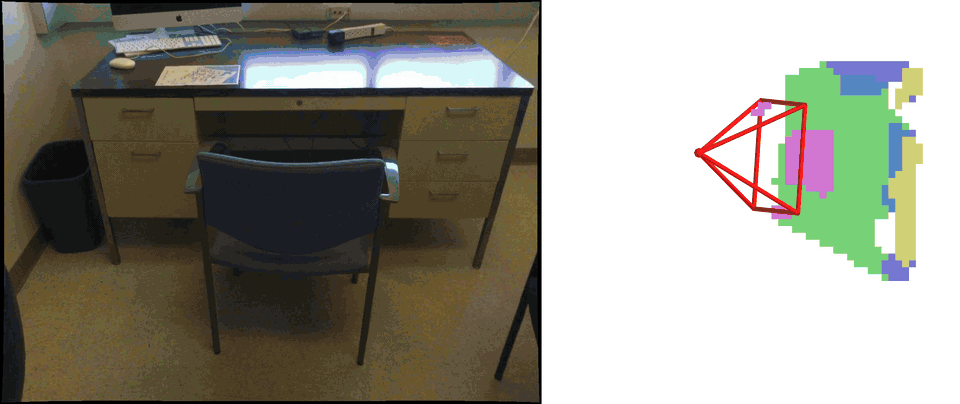
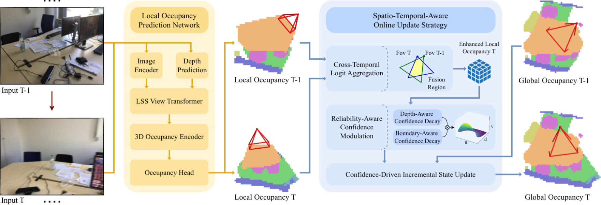

# VEOcc: Voxel-Centric Online Semantic Occupancy Prediction For Embodied Scene Understanding
### [Paper](todo)  | [Project Page](https://wryzju.github.io/VEOcc/) 

> VEOcc: Voxel-Centric Online Semantic Occupancy Prediction For Embodied Scene Understanding

> [Ruoyu Wang](https://april.zju.edu.cn/team/ruoyu-wang/), [Yukai Ma](https://april.zju.edu.cn/team/yukai-ma/), [Yuhang Lin](https://april.zju.edu.cn/team/yuhang-lin/), [Yong Liu](https://april.zju.edu.cn/our-team/)<sup>*</sup>

<sup>*</sup> Corresponding Author. 

<!-- EmbodiedOcc formulates **an embodied 3D occupancy prediction task** and proposes a Gaussian-based framework to accomplish it. -->

## Video Demonstration

More visualization results are provided in our [project page](todo).

## Overview

To address the challenges of incrementally constructing dense 3D representations on the fly, we present VEOcc, a robust voxel-centric framework for embodied occupancy prediction. By completely eliminating the need for an initial scale estimation phase, VEOcc enables highly memory-efficient, open-ended map expansion. Powered by a novel Spatio-Temporal-Aware Online Update Strategy, our framework recursively assimilates noisy multi-view observations into a coherent global state, establishing new state-of-the-art performance across both local and embodied prediction tasks.



## Getting Started

### Installation
Follow instructions [HERE](docs/installation.md) to prepare the environment.

### Data Preparation
1. Prepare **posed_images** and **gathered_data** following the [Occ-ScanNet dataset](https://huggingface.co/datasets/hongxiaoy/OccScanNet) and move them to **data/occscannet**.

2. Download **global_occ_package** and **streme_occ_new_package** from the [EmbodiedOcc-ScanNet](https://huggingface.co/datasets/YkiWu/EmbodiedOcc-ScanNet).
Unzip and move them to **data/scene_occ**.

3. Cache DepthAnything predictions for accelerated training:
    ```
    torchrun --nproc_per_node=4  run_mono_depth.py --py-config config/run_mono_depth_config.py
    ```

**Folder structure**
```
VEOcc
├── ...
├── data/
│   ├── occscannet/
│   │   ├── depth_cache/
│   │   ├── gathered_data/
│   │   ├── posed_images/
│   │   ├── train_final.txt
│   │   ├── train_mini_final.txt
│   │   ├── test_final.txt
│   │   ├── test_mini_final.txt
│   ├── scene_occ/
│   │   ├── global_occ_package/
│   │   ├── streme_occ_new_package/
│   │   ├── train_online.txt
│   │   ├── train_mini_online.txt
│   │   ├── test_online.txt
│   │   ├── test_mini_online.txt
```
### Before Running
1. In our experimental setup, we use pre-computed depth predictions for training, and perform online depth prediction during evaluation. You can modify this setting here:
    ```
    model = dict(
        type='VoxelSegmentor',
        build_depthanything=False, # Set to True to enable depth prediction
        ...
    )
    ```
2. Download checkpoints if you need:

    Task | Dataset | Split | IoU | mIoU | Download |
    | :---: | :---: | :---: | :---: | :---: | :---: |
    | Local Pred | OccScanNet | mini | 67.89 | 58.68 | [ckpt](todo)/[log](./workdir/train_mono_mini_final/20260403_204406.log)|
    | Local Pred | OccScanNet | full  | 64.55 | 55.49 | [ckpt](todo)/[log](./workdir/train_mono_full_final/20260405_121411.log)|
    | Embodied Pred | EmbodiedOcc-ScanNet | mini | 64.19 | 54.06 | [ckpt](todo)/[log](./workdir/train_embodied_mini_final/20260407_101619.log)|
    | Embodied Pred | EmbodiedOcc-ScanNet | full  | 62.21 | 53.00 | [ckpt](todo)/[log](./workdir/train_embodied_full_final/20260407_095601.log)|

### Train

1. Train local occupancy prediction module using 4 GPUs on Occ-ScanNet and Occ-ScanNet-mini:
    ```
    torchrun --nproc_per_node=4 train_mono.py --py-config config/train_mono.py --work-dir workdir/train_mono
    torchrun --nproc_per_node=4 train_mono.py --py-config config/train_mono_mini.py --work-dir workdir/train_mono_mini
    ```
2. Train embodied occupancy prediction using 4 GPUs on EmbodiedOcc-ScanNet and 4 GPUs on EmbodiedOcc-ScanNet-mini:
    ```
    torchrun --nproc_per_node=4 train_embodied.py --py-config config/train_embodied.py --work-dir workdir/train_embodied
    torchrun --nproc_per_node=4 train_embodied.py --py-config config/train_embodied_mini.py --work-dir workdir/train_embodied_mini
    ```

### Evaluation
1. Evaluate local occupancy prediction module using 4 GPUs on Occ-ScanNet and Occ-ScanNet-mini:
    ```
    torchrun --nproc_per_node=4 eval_mono.py --py-config config/eval_mono.py --work-dir workdir/eval_mono --ckpt-path checkpoints/mono.pth
    torchrun --nproc_per_node=4 eval_mono.py --py-config config/eval_mono_mini.py --work-dir workdir/eval_mono_mini --ckpt-path checkpoints/mono_mini.pth
    ```
2. Train EmbodiedOcc using 8 GPUs on EmbodiedOcc-ScanNet and 4 GPUs on EmbodiedOcc-ScanNet-mini:
    ```
    torchrun --nproc_per_node=4 eval_embodied.py --py-config config/eval_embodied.py --work-dir workdir/eval_embodied --ckpt-path checkpoints/embodied.pth
    torchrun --nproc_per_node=4 eval_embodied.py --py-config config/eval_embodied_mini.py --work-dir workdir/eval_embodied_mini --ckpt-path checkpoints/embodied_mini.pth
    ```
### Visualization
1. Evaluate with --save-ply param:
    ```
    # local
    torchrun --nproc_per_node=4 eval_mono.py --py-config config/eval_mono_mini.py --work-dir workdir/eval_mono_mini --ckpt-path checkpoints/mono_mini.pth --save-ply
    # embodied
    torchrun --nproc_per_node=4 eval_embodied.py --py-config config/eval_embodied_mini.py --work-dir workdir/eval_embodied_mini --ckpt-path checkpoints/embodied_mini.pth --save-ply
    ```
2. Run scripts for visualization:
    ```
    # local
    bash visualization/vis_occ.sh
    # or
    bash visualization/vis_occ_rot.sh

    # embodied
    bash visualization/vis_occ_online.sh
    ```

## Related Projects

Our work is inspired by these excellent open-sourced repos:
[L2COcc](https://github.com/StudyingFuFu/L2COcc)
[mmdetection3d](https://github.com/open-mmlab/mmdetection3d)

Our code is based on [EmbodiedOcc](https://github.com/ykiwu/embodiedocc). Visualization scripts is modified from the [visualization repository](https://github.com/Made-Gpt/visualization_tools) of [SplatSSC](https://github.com/Made-Gpt/SplatSSC). 

## Citation

If you find this project helpful, please consider citing the following paper:
```
TODO
```
